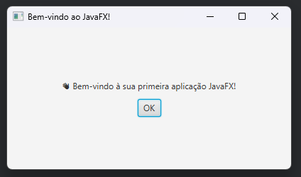

# Projeto Padrão para JavaFX


Projeto de estudos em JavaFX com JDK 21 e JavaFX 21.

## Descrição

Este projeto é um aplicativo de estudo em JavaFX que serve como base para aprender:

- Criação de interfaces com FXML
- Uso de `FXMLLoader`, `Stage` e `Scene`
- Estrutura de pacotes Java organizada
- Integração com Maven para build e execução

O projeto inclui uma tela simples de boas-vindas.

## Captura de tela



## Badges


## Pré-requisitos

- **Java JDK 21 ou superior**
    - Baixar: [Oracle JDK](https://www.oracle.com/java/technologies/javase/jdk21-archive-downloads.html) ou [Adoptium Temurin](https://adoptium.net/)
- **Maven**
    - Baixar: [Apache Maven](https://maven.apache.org/download.cgi)
- IDE recomendada: **IntelliJ IDEA** ou qualquer IDE que suporte Maven e JavaFX


## Como executar

### 1️⃣ Clonando o projeto

```bash
git clone https://github.com/maiconalbertini/ProjetoPadraoJAVAFX.git
cd ProjetoPadraoJAVAFX
```

### 2️⃣ Usando IntelliJ

1. Abra o projeto no IntelliJ
2. Execute a classe principal `br.eng.MainApp`


### 3️⃣ Usando Maven no terminal

Na pasta raiz do projeto:

```bash
mvn clean package
mvn javafx:run
```